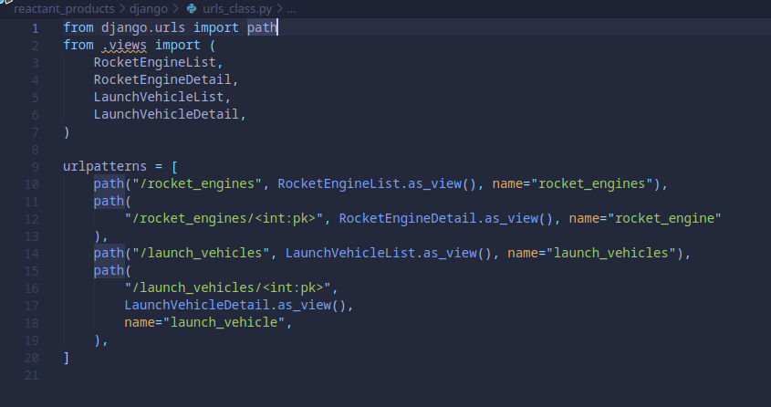

<p align="center">
    <a href="https://pypi.org/project/reactant">
        
    </a>
</p>

Generate code for *models, views, and urls* based on Python type annotations. Powered by [pydantic](https://github.com/samuelcolvin/pydantic/). Influenced by [SQLModel](https://github.com/tiangolo/sqlmodel).

*reactant* aims to give usable and sensible code defaults. It does **not enforce** a particular application structure. Instead, it follows the default/minimal/common structure of the supported frameworks, and the developer has the freedom of changing it (if necessary) to fit it to their application. Contributions are warmly welcomed if you believe a particular structure is widely used and can benefit from code generation.

## Supported Frameworks

*reactant* currently generates code for the following:

**Django REST** (Django 3+, DRF 3.12+)

(in Django's *default* project structure i.e. by *apps*)

- [X] models
- [X] views (class-based API views, filename=*views_class.py*)
- [X] views (function-based API views, filename=*views_func.py*)
- [X] views (modelviewset, filename=*views_modelviewset.py*)
- [X] serializers
- [X] urls (using class-based API views, filename=*urls_class.py*)
- [X] urls (using function-based API views, filename=*urls_func.py*)
- [X] urls (using viewset, filename=*urls_viewset.py*)

**Flask** (Flask 2+)

(package structure, for building REST APIs)

- [ ] views

**SQLAlchemy** (SQLAlchemy 1.4+)

- [X] classes mapped by Declarative Mapping
- [X] classes mapped by Classical Mapping

**Peewee** (Peewee 3.14+)

- [X] models

## Installation

```cli
pip install reactant
```

NOTE: *reactant* isn't shipped with the supported frameworks. You MUST install `django`, `sqlalchemy`, `peewee`, or `flask` separately (be it in a virtual environment or globally).

## Get Started

Create *reactant* models by inheriting from `Reactant` subclasses: `DjangoORM`, `SQLAlchemyORM`, `PeeweeORM`. The example below uses `DjangoORM`. Your choice will determine what code and files will be generated.

```python
# generate.py

from typing import Optional
from reactant import DjangoORM, Field, generate
from datetime import date


class RocketEngine(DjangoORM):
    name: str = Field(max_length=32, title="engine_name") # adding additional arguments
    manufacturer: Optional[str]
    power_cycle: Optional[str] = "gas-generator" # setting a default
    thrust_weight_ratio: Optional[int] = None


class LaunchVehicle(DjangoORM):
    name: str = Field(max_length=32)
    country: str = Field("USA", max_length=32) # setting a default in the Field function 
    status: str
    total_launches: Optional[int]
    first_flight: Optional[date]
    engine: str = Field(foreign_key="RocketEngine") # specifying a relationship field

# Don't forget this block.
if __name__ == "__main__":
    generate()

```

You can give ORM-specific arguments to the `Field` function. For more details, please read the [The Field function](#the-field-function) section.

Don't forget `generate()`. Run by specifying the file: `reactant generate.py`

Tip: You can control what code and files will be generated by passing keyword arguments to `generate()`. Read the [The generate function](#the-generate-function) section for the details. 

```cli
$ reactant generate.py

Running generate.py
Found 2 Django reactants.
Django models.py finished rendering.
Django serializers.py finished rendering.
Django views_class.py finished rendering.
Django urls_class.py finished rendering.
Django views_func.py finished rendering.
Django urls_func.py finished rendering.
Success! Please check "reactant_products/django" directory.
```

**BOOM!** With just the above code, the models, views, serializers, and urls (the *products*, for Django atleast) are generated. See images of the code below.

## Sample Code Generated

### Django REST





## The Field function

The *reactant* `Field` function comes from pydantic. It can be used to provide extra information about the field. Currently though, *reactant* `Field` can only support the following pydantic native arguments:

- `default` (the positional argument)
- `max_length`
- `title`

Other than the listed native arguments, *reactant* `Field` can accept arguments that are specific to an ORM and filters out those that are not supported by the same ORM. For example if you are generating Django files, Django ORM model fields can accept an `error_messages` argument. You can give this argument to the *reactant* `Field` and the generated Django models will include this argument. However, if you give made-up arguments or arguments that are only valid for other ORMs, the generated Django models will not include those.

### Specifying model relationships

Relationship fields can be specified by giving the *reactant* `Field` special arguments.

- `foreign_key` - identifies a foreign key
- `many_key` - identifies a many-to-many
- `one_key` - identifies a one-to-one

These behave differently for each framework. The [Get Started](#get-started) section shows an example of specifying a relationship.

**Django REST**: Models inheriting from `DjangoORM` can use `foreign_key`, `many_key`, and `one_key` to establish relationships. The [Get Started](#get-started) section shows a `DjangoORM` example.

**SQLAlchemy**: *reactant* aims not to introduce anything new except having knowledge of type hints and pydantic. It was hard to capture and generate SQLAlchemy relationships without introducing new *reactant* concepts due to SQLAlchemy's flexibility. Nevertheless, relationship code are still generated and you are given options as to what relationship you intend to build.

Currently, only the `foreign_key` parameter is available for establishing relationships. You may put the `Field` function with this parameter to any of your classes since the generated code will provide options for your intended relationship: One-to-Many, Many-to-One, One-to-One. Using `SQLAlchemyORM` for the reactant models in [Get Started](#get-started) section, the following code is generated:


**Peewee**: *reactant* models with `PeeweeORM` can use `foreign_key` parameter.

## The generate function

The `generate` function can accept keyword arguments to control the behavior of generating code and files. Read below to learn what each supported framework accepts.

### Django REST

By default, all of function-based, class-based, and viewset-based views are generated. To switch OFF any of them, pass `class_based=False` or `function_based=False` or `viewset_based=False` 

## Development

The project uses Poetry to package and manage dependencies.

```cli
(venv)$ poetry install
```

Run tests.

```cli
pytest
```

Do linting.

```cli
bash scripts/lint-check.sh
```

Fix formatting.

```cli
bash scripts/format.sh
```

## License

MIT License. For more information and legal terms, see the LICENSE file.
